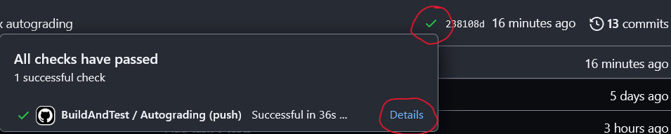
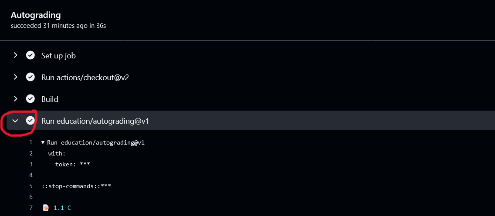

[](https://classroom.github.com/a/kl5dOX06)
 

# Inf2C-CS 2023/24 | Coursework 1 | MIPS

**Deadline:** Friday 27th October 2023 at 16:00 BST
**Instructors:** Boris Grot, Yuvraj Patel
**TA:** David Schall

The objective of this coursework is to get you familiar with programming in MIPS. There are a number of tasks which require you to write solutions in the provided skeleton files. For each task, we have provided some associated tests, which you can use to check your solutions.

Each test case is worth points, and you can obtain these points by correctly passing the test case. Your points balance is shown at the top of the README, and will update every time you push changes to GitHub.

Please note that your point balance is **NOT** your final grade. After the deadline, your code will be subject to further hidden testing, so it is important that you also write your own tests, to ensure that your code is thoroughly tested.

## 1. Downloading the coursework

To get started, you will need to **clone** this repository. If you have used GitHub before, you will already have a HTTPS access token or an SSH key. If you do not have either, you will need to create one of them following the guides below:
  - To create an SSH key, use [this guide](https://docs.github.com/en/authentication/connecting-to-github-with-ssh/generating-a-new-ssh-key-and-adding-it-to-the-ssh-agent).
  - To create a HTTPS token, use [this guide](https://docs.github.com/en/authentication/keeping-your-account-and-data-secure/creating-a-personal-access-token). Feel free to tick all the boxes when asked what permissions you would like to grant this token.

At this point, you can clone the repository:
  - If you used HTTPS above, use the command:
    ```
    git clone https://github.com/inf2c-cs-2022/REPOSITORY_NAME.git
    ```
  - If you used SSH, use the command:
    ```
    git clone git@github.com:inf2c-cs-2022/REPOSITORY_NAME.git
    ```
Once the clone has finished, you can enter the repository directory:
```
cd REPOSITORY_NAME
```
If this is your first time using Git, you will need to do a bit of configuration:
  ```
  git config --global user.name "your_github_username"
  git config --global user.email "your_github_email"
  ```
This will set your username and email globally, so all future GitHub repositories will inherit this configuration (unless they overwrite it). If you do not wish to do that, just omit the `--global`. You can verify the setup using `git config -l`, which will tell you what you just set.

## 2. Writing your solutions

In the `src` folder, you will find various template files, one per task. You should write your solution for each task into the skeleton file indicated in the task description. The tasks build upon each other so you are welcome to reuse functions from previous tasks.

## 3. Pushing your changes to GitHub

You are encouraged to commit your work regularly. This allows you to track the history of your changes and revert to an earlier version of your code, if you need to. It also protects you from losing any of your work in the case of a computer failure. Furthermore, every time you commit and push your changes, your points on the README are updated, giving you continuous feedback on your implementation.
As mentioned above, your point balance is **NOT** your final grade.

To find out which tests fail you can access the test log using the following steps:
Once, you have pushed your changes the test will automatically start running. Once completed you will see a green tick or a red cross next to your commit hash. Click on the tick or cross then _details_ on the opening callout.


You will find the test log by expanding the *Run education/autograding@v1* section.

Correct test are marked with a green tick and incorrect tests with a red cross.
You can find the inputs and outputs of the tests in `.github/classroom/autograding.json`. You can use this to debug your code.


## 4. Testing your solutions locally

Throughout this coursework, you will be asked to write both C programs and MIPS programs. In addition to the GitHub tests, you should run your own tests. To test your programs locally, use the following commands from within the `coursework1` directory:

- `cmake .`
- `make`
- `make test`

> You must have `cmake` install to build and run the tests. On ubuntu simply `apt install cmake` should work. For other environments refer to the specific installation guides.

This will run all of the tests defined in the `CMakeLists.txt` file. There is one test already defined in this file as an example, and you should use this to add your own tests. The `echo` command is used to write the input into the text file before running the program, and the `set_tests_properties` command specifies the expected output.

If you want to focus on one specific test, perhaps for debugging purposes, you can do this manually using MARS. Simply set the input file to contain the parameters you want, then click `assemble` and `run` in the MARS IDE and step through the code at your desired pace. **If you wish to do this, you MUST ensure that you invoke MARS from the same directory as the input file, so that MARS can access the file. Failure to do so will likely cause runtime errors. This is because the input file path is relative, not absolute.**

For each task, you will be required to write a MIPS program. For the first two tasks, you will be also be asked to write a C program.
We encourage you to write the solution in C first, then translate it into MIPS. This will help you to better understand the algorithm on a higher level before you implement it in MIPS.
The provided test cases will test both your C code and your MIPS code, but the MIPS test cases attract more points than the C test cases.
For tasks 3 to 6, you will only be required to write the MIPS program. However, C templates and test cases are provided for you in case you want to implement and test your algorithm first in C (highly recommended!). You will **NOT** receive any points for passing these tests and are only for your convenience.


## 5. Input and output

The skeleton code provided for each task will read the input text from a file named `task<>.txt` into a buffer in memory for you. It should be obvious where the input for each task is stored from reading the task descriptions and inspecting the templates, but if not, please ask for clarification on Piazza.
The input will be a string of words, separated by spaces (ASCII character `0x20`).
To simplify things, we will only deal with lower case letters, meaning that any input text will only contain the characters `a` to `z` (`0x61` to `0x7A`). The input text will not contain any punctuation, and will not contain any numbers. The input text will be terminated by a newline character (`0x0A`).

You may assume that we only provide valid input, and you do not need to check for invalid input. For example, you do not need to check that the input text is terminated by a newline character, or that the input text only contains lowercase letters and spaces. Also, there will be no empty string.

Finally, the given input text will not be longer than 1000 characters, and will not contain more than 100 words. Each word will be no longer than 30 characters. You may use these limits to implement fixed-size buffers if you wish.


## 6. Compression techniques

Data compression is the process of encoding information, restructuring, or modifying the data to reduce its size compared to the original representation. There are several algorithms available that one can employ to compress the data. Data compression is beneficial in multiple scenarios. For example, it can lead to significantly less storage capacity than uncompressed files, thereby reducing the storage requirement significantly. Similarly, compared to a larger file, a smaller file requires less time to transfer, thereby needing less network bandwidth. Hence, data compression helps in reducing the overall resource cost. Data compression algorithms can be of two types -- lossy and lossless. Lossless compression reduces bits by identifying and eliminating statistical redundancy without losing any information. On the other hand, lossy compression reduces bits by removing unwanted, unnecessary, or less important information.

The overall goal of this coursework is to implement a lossless simple text compression algorithm. The basic idea is to build a list (or _dictionary_) of unique words appearing in the text, assign each one a numerical code, and replace each occurrence of the word in the text with the numerical code. For example, the sentence `bob meets mary and mary meets bob` could be compressed to `1 2 3 4 3 2 1`. The dictionary would then map `1` to `bob`, `2` to `meets`, `3` to `mary` and `4` to `and`. This is a very simple example, but it illustrates the basic idea. In practice, we would use a more sophisticated compression algorithm, but this is beyond the scope of this coursework.
A good overview of different compression techniques, not only for text, can be found [here](https://isaaccomputerscience.org/concepts/data_compr_loss?examBoard=all&stage=all).

You will start with simple tasks to process and print the input text to then gradually build up a dictionary-based compression algorithm. The final task is slightly more advanced, which requires you to compress the text using the [Huffman encoding](https://isaaccomputerscience.org/concepts/data_compr_loss?examBoard=all&stage=all)

**For tasks 1(7.1) and 2(7.2), you will be graded for the C and MIPS program. From task 3(7.3) onwards, you will only be graded for the MIPS program.**

## 7.1 Task 1 (5 points C + 5 points MIPS)

### Count the number of words in a text.

This is a warm-up exercise and is intended to be fairly simple. In this task, you will be given a string of words and you are supposed to count and return the number of words the string consists of. For example, for the input string `computer science is cool`, your output should be `4`, terminated by a newline.

The input text can be found in the fixed-length array `input_text`. The files `src/t1_word_count.c` and `src/t1_word_count.s` contain templates for you to get started.


## 7.2 Task 2 (5 points C + 5 points MIPS)

### Print individual words.

Next task is to print each word of the input text on a separate line in the order of their appearance. For example, for the input string `computer science is cool`, your output should be:
```
computer
science
is
cool
```

Use the templates `src/t2_print_words.c` and `src/t2_print_words.s` to implement this task.


## 7.3 Task 3 (30 points)

### Print unique words.

In this task, you are supposed to print only the unique words in the input text, in the order of their first occurrence. One word per line in the format of a numbered list (the first word is given 1, the second unique word gets 2,...). The number and word should be separated by a space. For example, for the input string `bob meets mary and mary meets bob`, your output should be:
```
1 bob
2 meets
3 mary
4 and
```

For simplicity, you can assume that the input has no more than 100 words, and each word is no longer than 30 characters.
Use the template `src/t3_unique_words.s` to implement this task.
Note there is also a C template that you can develop your algorithm. You will **NOT** receive any points for passing the C tests from hereon.

## 7.4 Task 4 (10 points)

### Compress the text.

You may realize that in the previous task, you built the dictionary of our compression algorithm. In this task, you are supposed to compress the input text using the dictionary you built in the previous task. For that, replace each word with its corresponding number in the dictionary.
For example, for the input string `bob meets mary and mary meets bob`, your output should be:
```
1 2 3 4 3 2 1
```

As before, templates are provided for both C and MIPS but only the MIPS program will be graded (`src/t4_compress.c` and `src/t5_compress.s`).

## 7.5 Task 5 (20 points)

### Compress only repeating words.

In task 4, you only returned the compressed text in the form of the corresponding numbers in your dictionary. Encoding `bob meets mary and mary meets bob` as `1 2 3 4 3 2 1` led to a substantial reduction from 33 to 13 characters (counting symols and spaces).
However, to be able to decompress the text, the dictionary must be stored as well. In our example, storing the dictionary along with the compressed text adds 23 additional characters making the compression counter-productive.

You will realize that one inefficiency of the previous task is that we replaced all words, even if they occur only once in the text. In the case of bob and mary the word `and` occurs only once in the text. Creating an entry in the dictionary for it increases the size instead of reducing it (one additional digit in the text and one additional digit in the dictionary).

In this task, you should avoid this inefficiency by only replacing words with their corresponding number if they are repeated. For example, for the input string `bob meets mary and mary meets bob`, your output should be:
```
1 2 3 and 3 2 1
```
You should also return the dictionary. Hence, the complete output for the example above is:
```
1 2 3 and 3 2 1
1 bob
2 meets
3 mary
```
Note that the numbering of the words in the dictionary is sequential, starting with 1, and does not necessarily reflect the position of the first occurrence of a word in the input text. For instance, for the the input `bob meets little mary and mary meets bob` the correct output is:
```
1 2 little 3 and 3 2 1
1 bob
2 meets
3 mary
```

As before, templates are provided for both C and MIPS but only the MIPS program will be graded (`src/t5_compress_more.c` and `src/t5_compress_more.s`).


## 7.6 Task 6 (20 points)

### Compress the text using Huffman encoding.

In this task, you are supposed to compress the input text using the Huffman encoding. The Huffman encoding is a lossless compression technique that uses variable-length codes to represent symbols. The variable-length codes are based on the frequency of each symbol in the input text. The more frequent a symbol is, the shorter its code is. The codes are constructed in a way that no code is a prefix of another code. This is called a prefix-free code. This allows us to decode the compressed text without any ambiguity. There are plenty of examples on the internet that explain the Huffman encoding in more detail.

The Huffman encoding consists of the following steps:
1. Process the input text and count the frequency of each symbol.
2. Build a Huffman tree based on the frequency of each symbol.
3. Traverse the Huffman tree and assign a code to each symbol.
4. Encode the input text using the codes assigned to each symbol.

We will guide you through each step in more details below. For each subtask, we provide a test to check if you are on right track or not. We do encourage you to add more test cases to ensure that you cover all the aspects while implementing.

Implement the Huffman encoding in the template `src/t6_huffman.s`. The C file `src/t6_huffman.c` is provided if you want to test your implementation. You will **NOT** receive any points for passing the C tests.

#### 7.6.1 Count the frequency of each symbol (8 points)
The first step is to count the frequency of each symbol in the input text. In our case, the symbols are the characters in the input text. For simplicity in this task, you can assume that the input text only contains the characters `a` to `z` (`0x61` to `0x7A`). There are **no** spaces as opposed to the previous tasks. The input text is at max 100 characters long and will be terminated by a newline character (`0x0A`).

For example, for the input string `abracadabra`, `a` occurs 5 times `b` and `r` two times and so on. For this first subtask, you should build the frequency map and return it in the form `character frequency\n`.

The frequency map must be ordered by the following rules:
1. The map starts with the most frequent character and ends with the least frequent character.
2. If two characters have the same frequency, the order should be in lexical order. Hint: This is also the order of the corresponding ASCII values.

Hence, for the example above the correct output is:
```
a 5
b 2
r 2
c 1
d 1
```

#### 7.6.2 Build the Huffman tree (8 points)
The next step is to build the Huffman tree. The Huffman tree is a binary tree that is built based on the frequency of each symbol. The more frequent a symbol is, the closer it is to the root of the tree. To build the Huffman tree from our frequency map, we use the following algorithm:

1. Take the last two elements from the frequency map and create a new node with the sum of their frequencies as the frequency of the new node. The new node is the parent of the two elements.
Hence in our example, we take the last two elements `c` and `d` and create a new node with the frequency `1 + 1 = 2`. The new node is the parent of `c` and `d` and becomes `cd`. IMPORTANT: The last node in the frequency map is always right to the second last node. Hence, for our example it is `cd` and not `dc` and the corresponding subtree would look like this:

```
  cd
 /  \
c    d
```

2. Remove the two symbols from the frequency map and add the new node to the frequency map. The new node is inserted in the correct position according to the same rules as described before in 7.6.1. The first character of the new node defines its lexical order. Hence, `cd` is inserted before `r` and after `b`. The frequency map now looks like this:
```
a 5
b 2
cd 2
r 2
```
3. Repeatedly apply steps 1 and 2 until only one node is left in the frequency map. This node is the root of the Huffman tree.

Correspondingly, the frequency map would look like this after the next iterations:
```
two:
a 5
cdr 4
b 2

three:
cdrb 6
a 5

and finally:
cdrba 11
```


The Huffman tree for our example looks like this:
```
            cdrba
           /     \
          cdrb    a
         /    \
       cdr     b
      /   \
     cd    r
    /  \
   c    d
```

To test the subtask to be correct print the root node, hence the remaining node in the frequency map, in the form `root frequency\n` after the frequency map plotted in the first task. For our example, the correct output is:
```
a 5
b 2
r 2
c 1
d 1
cdrba 11
```

#### 7.6.3 Traverse the Huffman tree and assign a code to each symbol
The next step is to traverse the Huffman tree and assign a code to each symbol. The code is a sequence of `0` and `1` that is constructed by traversing the Huffman tree from the root to the symbol. Each time we go left we add a `0` to the code and each time we go right we add a `1` to the code. The code for each symbol is the sequence of `0` and `1` from the root to the symbol. Hence, the following codes would map to each character in our example:
```
a 1
b 01
r 001
c 0000
d 0001
```
For this subtask, you don't need to print anything because the last step is trivial.

#### 7.6.4 Encode the input text (4 points)
The last step is to encode the input string with the symbol table you have created. For that replace each symbol with its corresponding code. The encoded form of our example word `abracadabra` would be:

a | b | r | a | c | a | d | a | b | r | a
---| --- | --- | ---| --- | --- | --- | --- | --- | --- | --- |
1 | 01 | 001 | 1 | 0000 | 1 | 0001 | 1 | 01 | 001 | 1

Print the finally encoded text to get the full points for this task. For our example, the correct output is:
```
a 5
b 2
r 2
c 1
d 1
cdrba 11
10100110000100011010011
```


## 8. Submitting your code

Once you have pushed all of your changes to GitHub and you are happy with your code and your points, you are finished! At the deadline, we will revoke your write access to this repository and grade your work. The last version committed before the deadline is the one that will be marked. 

## 9. Good scholarly practice

Please remember the good scholarly practice requirements of the University regarding work for credit. You can find guidance on the School page:

https://web.inf.ed.ac.uk/infweb/admin/policies/academic-misconduct

This also has links to the relevant University pages.

As mentioned, your code will be subject to further automatic and manual review after the deadline. Submitted code will be checked for similarity with other submissions using the [MOSS system](http://theory.stanford.edu/~aiken/moss/). MOSS has been effective at finding similarities in the past and it is not fooled by name changes or reordering of code blocks. Courseworks are **individual**, and we expect everyone to submit their sole, independent work.

Extensions or Extra Time Adjustments (ETA) are permitted up to a maximum of six days, but cannot be combined. If assessed coursework is submitted late without an approved extension or ETA, a penalty of 5% per calendar day will be applied, up to a maximum of six days after the original deadline, after which a mark of zero will be given.

## 10. Asking questions

If you have questions about MIPS, you should consult the lecture slides, lab materials and the appendix of the Patterson and Hennessy course textbook. If you have questions about the coursework, please start by **checking existing discussions** on Piazza. You should only start a new discussion if you cannot find the answer in the existing posts. It is quite possible that other students will already have encountered and solved the same problem and will be able to help you. The TA will also monitor Piazza and clarify things as necessary, after allowing time for student discussion to take place. Please be reminded that academic misconduct regulations also apply to Piazza, so you should **not** post coursework solutions or code snippets publicly. If in doubt, make your question private, and an instructor will check if the post is acceptable.
